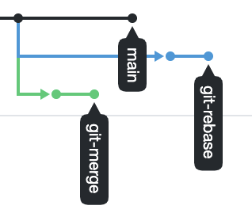
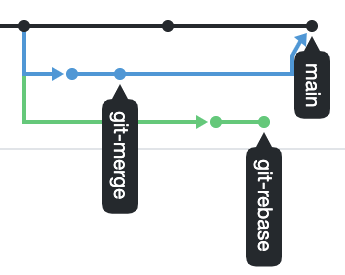

## «2.3. Ветвления в Git» - Захаров Сергей Николаевич

---
* Ответы на задания даны после каждого из них.
* Общий ход выполнения ДЗ можно посмотреть [здесь](https://github.com/zakharovnpa/01-devops-admin-homeworks/blob/main/02-git-03-branching/Lesson/Lesson.md)
* Репозиторий с выполненным ДЗ [здесь](https://github.com/zakharovnpa/branching-git/tree/master)

---

Давайте потренеруемся делать merge и rebase, чтобы понять разницу и научиться решать конфликты.

## Задание №1 – Ветвление, merge и rebase. 

1. Предположим, что есть задача написать скрипт, выводящий на экран параметры его запуска. 
Давайте посмотрим, как будет отличаться работа над этим скриптом с использованием ветвления, мержа и ребейза. 
Создайте в своем репозитории каталог `branching` и в нем два файла `merge.sh` и `rebase.sh` с 
содержимым:
```bash
#!/bin/bash
# display command line options

count=1
for param in "$*"; do
    echo "\$* Parameter #$count = $param"
    count=$(( $count + 1 ))
done
```

Этот скрипт отображает на экране все параметры одной строкой, а не разделяет их.

**Ответ:**

В директории ` brancing ` созданы файлы ` merge.sh ` и ` rebase.sh ` 
```sh
root@PC-Ubuntu:~/devops-netology/zakharovnpa/branching# vim merge.sh
root@PC-Ubuntu:~/devops-netology/zakharovnpa/branching# 
root@PC-Ubuntu:~/devops-netology/zakharovnpa/branching# vim rebase.sh
root@PC-Ubuntu:~/devops-netology/zakharovnpa/branching# 
root@PC-Ubuntu:~/devops-netology/zakharovnpa/branching# cat merge.sh 
#!/bin/bash
# display command line options

count=1
for param in "$*"; do
    echo "\$* Parameter #$count = $param"
    count=$(( $count + 1 ))
done
```
```sh
root@PC-Ubuntu:~/devops-netology/zakharovnpa/branching# cat rebase.sh 
#!/bin/bash
# display command line options

count=1
for param in "$*"; do
    echo "\$* Parameter #$count = $param"
    count=$(( $count + 1 ))
done
```

2. Создадим коммит с описанием `prepare for merge and rebase` и отправим его в ветку main. 

**Ответ:**

Находясь не ветке ` master ` создал коммит:

```sh
root@PC-Ubuntu:~/devops-netology/zakharovnpa/branching# git commit -m "prepare for merge and rebase"
[master (корневой коммит) e12ef31] prepare for merge and rebase
 2 files changed, 16 insertions(+)
 create mode 100644 branching/merge.sh
 create mode 100644 branching/rebase.sh
```
```sh
root@PC-Ubuntu:~/devops-netology/zakharovnpa/branching# git log
commit e12ef31c210e4030c67c1c0e809b3d446c18d774 (HEAD -> master)
Author: Sergey Zakharov <zakharovnpa@gmail.com>
Date:   Fri Jan 14 09:17:08 2022 +0400

    prepare for merge and rebase
```

#### Подготовка файла merge.sh.
1. Создайте ветку `git-merge`. 

**Ответ:**

Создана ветка ` git-merge ` и сразу переключились на нее:
```sh
root@PC-Ubuntu:~/devops-netology/zakharovnpa/branching-git# git checkout -b git-merge
Переключено на новую ветку «git-merge»
```
```sh
root@PC-Ubuntu:~/devops-netology/zakharovnpa/branching-git# git log
commit e12ef31c210e4030c67c1c0e809b3d446c18d774 (HEAD -> git-merge, master)
Author: Sergey Zakharov <zakharovnpa@gmail.com>
Date:   Fri Jan 14 09:17:08 2022 +0400

    prepare for merge and rebase
```
2. Замените в ней содержимое файла `merge.sh` на
```bash
#!/bin/bash
# display command line options

count=1
for param in "$@"; do
    echo "\$@ Parameter #$count = $param"
    count=$(( $count + 1 ))
done
```

**Ответ:**

```sh
root@PC-Ubuntu:~/devops-netology/zakharovnpa/branching-git/branching# vim merge.sh 
root@PC-Ubuntu:~/devops-netology/zakharovnpa/branching-git/branching# 
root@PC-Ubuntu:~/devops-netology/zakharovnpa/branching-git/branching# cat merge.sh 
#!/bin/bash
# display command line options

count=1
for param in "$@"; do
    echo "\$@ Parameter #$count = $param"
    count=$(( $count + 1 ))
#!/bin/bash
done

```

3. Создайте коммит `merge: @ instead *` отправьте изменения в репозиторий.

**Ответ:**

Создан коммит ` merge: @ instead * ` и отправлен в удаленный репозиторий
```sh
root@PC-Ubuntu:~/devops-netology/zakharovnpa/branching-git/branching# git add merge.sh 
root@PC-Ubuntu:~/devops-netology/zakharovnpa/branching-git/branching# 
root@PC-Ubuntu:~/devops-netology/zakharovnpa/branching-git/branching# git commit -m "merge: @ instead *"
[git-merge 371a772] merge: @ instead *
 1 file changed, 3 insertions(+), 2 deletions(-)
```
```sh
root@PC-Ubuntu:~/devops-netology/zakharovnpa/branching-git/branching# git log
commit 371a7721c17eb1b070569e4fa65e8e9a1b9e74d8 (HEAD -> git-merge)
Author: Sergey Zakharov <zakharovnpa@gmail.com>
Date:   Fri Jan 14 10:09:32 2022 +0400

    merge: @ instead *

commit e12ef31c210e4030c67c1c0e809b3d446c18d774 (master)
Author: Sergey Zakharov <zakharovnpa@gmail.com>
Date:   Fri Jan 14 09:17:08 2022 +0400

    prepare for merge and rebase
root@PC-Ubuntu:~/devops-netology/zakharovnpa/branching-git/branching# 
root@PC-Ubuntu:~/devops-netology/zakharovnpa/branching-git/branching# git log --graph --oneline
* 371a772 (HEAD -> git-merge) merge: @ instead *
* e12ef31 (master) prepare for merge and rebase
root@PC-Ubuntu:~/devops-netology/zakharovnpa/branching-git/branching# git push git@github.com:zakharovnpa/branching-git.git
fatal: Текущая ветка git-merge не имеет вышестоящей ветки.
Чтобы отправить текущую ветку и установить внешнюю ветку как вышестоящую для этой ветки, используйте

    git push --set-upstream git@github.com:zakharovnpa/branching-git.git git-merge
```
```sh
root@PC-Ubuntu:~/devops-netology/zakharovnpa/branching-git/branching# git push --set-upstream git@github.com:zakharovnpa/branching-git.git master
Перечисление объектов: 4, готово.
Подсчет объектов: 100% (4/4), готово.
При сжатии изменений используется до 6 потоков
Сжатие объектов: 100% (3/3), готово.
Запись объектов: 100% (4/4), 398 байтов | 398.00 КиБ/с, готово.
Всего 4 (изменения 0), повторно использовано 0 (изменения 0)
remote: 
remote: Create a pull request for 'master' on GitHub by visiting:
remote:      https://github.com/zakharovnpa/branching-git/pull/new/master
remote: 
To github.com:zakharovnpa/branching-git.git
 * [new branch]      master -> master
Ветка «master» отслеживает внешнюю ветку «master» из «git@github.com:zakharovnpa/branching-git.git».
```

4. И разработчик подумал и решил внести еще одно изменение в ` merge.sh ` 
```bash
#!/bin/bash
# display command line options

count=1
while [[ -n "$1" ]]; do
    echo "Parameter #$count = $1"
    count=$(( $count + 1 ))
    shift
done
```
Теперь скрипт будет отображать каждый переданный ему параметр отдельно. 

**Ответ:**

```sh
root@PC-Ubuntu:~/devops-netology/zakharovnpa/branching-git/branching# vim merge.sh 
root@PC-Ubuntu:~/devops-netology/zakharovnpa/branching-git/branching# 
root@PC-Ubuntu:~/devops-netology/zakharovnpa/branching-git/branching# git status
На ветке git-merge
Изменения, которые не в индексе для коммита:
  (используйте «git add <файл>…», чтобы добавить файл в индекс)
  (используйте «git restore <файл>…», чтобы отменить изменения в рабочем каталоге)
	изменено:      merge.sh

нет изменений добавленных для коммита
(используйте «git add» и/или «git commit -a»)
```
```sh
root@PC-Ubuntu:~/devops-netology/zakharovnpa/branching-git/branching# git add merge.sh 
root@PC-Ubuntu:~/devops-netology/zakharovnpa/branching-git/branching# 
root@PC-Ubuntu:~/devops-netology/zakharovnpa/branching-git/branching# git status
На ветке git-merge
Изменения, которые будут включены в коммит:
  (используйте «git restore --staged <файл>…», чтобы убрать из индекса)
	изменено:      merge.sh

root@PC-Ubuntu:~/devops-netology/zakharovnpa/branching-git/branching# 
```

5. Создайте коммит `merge: use shift` и отправьте изменения в репозиторий. 

**Ответ:**

```sh
root@PC-Ubuntu:~/devops-netology/zakharovnpa/branching-git/branching# git commit -m "merge: use shift"
[git-merge 33e704b] merge: use shift
 1 file changed, 3 insertions(+), 3 deletions(-)
```
```sh
root@PC-Ubuntu:~/devops-netology/zakharovnpa/branching-git/branching# git log --graph --oneline
* 33e704b (HEAD -> git-merge) merge: use shift
* 371a772 merge: @ instead *
* e12ef31 (master) prepare for merge and rebase
```
```sh
root@PC-Ubuntu:~/devops-netology/zakharovnpa/branching-git/branching# git push git@github.com:zakharovnpa/branching-git.git git-merge
Перечисление объектов: 7, готово.
Подсчет объектов: 100% (7/7), готово.
При сжатии изменений используется до 6 потоков
Сжатие объектов: 100% (3/3), готово.
Запись объектов: 100% (4/4), 447 байтов | 447.00 КиБ/с, готово.
Всего 4 (изменения 0), повторно использовано 0 (изменения 0)
To github.com:zakharovnpa/branching-git.git
   371a772..33e704b  git-merge -> git-merge
```

#### Изменим main.
1. Вернитесь в ветку `main`. 

**Ответ:**

Переключились на ветку ` master `
```sh
root@PC-Ubuntu:~/devops-netology/zakharovnpa/branching-git/branching# git checkout master
Переключено на ветку «master»
```
```sh
root@PC-Ubuntu:~/devops-netology/zakharovnpa/branching-git/branching# git status
На ветке master
нечего коммитить, нет изменений в рабочем каталоге
```
```sh
root@PC-Ubuntu:~/devops-netology/zakharovnpa/branching-git/branching# git log --graph --oneline
* e12ef31 (HEAD -> master) prepare for merge and rebase
```

2. Предположим, что кто-то, пока мы работали над веткой `git-merge`, изменил `main`. Для этого
изменим содержимое файла `rebase.sh` на следующее
```bash
#!/bin/bash
# display command line options

count=1
for param in "$@"; do
    echo "\$@ Parameter #$count = $param"
    count=$(( $count + 1 ))
done

echo "====="
```
В этом случае скрипт тоже будет отображать каждый параметр в новой строке. 

**Ответ:**

```sh
root@PC-Ubuntu:~/devops-netology/zakharovnpa/branching-git/branching# vim rebase.sh 
root@PC-Ubuntu:~/devops-netology/zakharovnpa/branching-git/branching# 
root@PC-Ubuntu:~/devops-netology/zakharovnpa/branching-git/branching# git status
На ветке master
Изменения, которые не в индексе для коммита:
  (используйте «git add <файл>…», чтобы добавить файл в индекс)
  (используйте «git restore <файл>…», чтобы отменить изменения в рабочем каталоге)
	изменено:      rebase.sh

нет изменений добавленных для коммита
(используйте «git add» и/или «git commit -a»)
```
```sh
root@PC-Ubuntu:~/devops-netology/zakharovnpa/branching-git/branching# git add rebase.sh 
root@PC-Ubuntu:~/devops-netology/zakharovnpa/branching-git/branching# 
root@PC-Ubuntu:~/devops-netology/zakharovnpa/branching-git/branching# git status
На ветке master
Изменения, которые будут включены в коммит:
  (используйте «git restore --staged <файл>…», чтобы убрать из индекса)
	изменено:      rebase.sh

```

3. Отправляем измененную ветку `main` в репозиторий.

**Ответ:**

При выполнении данного пункта выяснилось, что в задании не хватает указания на выполнение коммита перед отправкой. Поэтому был создан еще один незапланированный коммит ` noname commit - cheange main `
```sh
root@PC-Ubuntu:~/devops-netology/zakharovnpa/branching-git/branching# git push git@github.com:zakharovnpa/branching-git.git master
Everything up-to-date
```
```sh
root@PC-Ubuntu:~/devops-netology/zakharovnpa/branching-git/branching# git commit -m "noname commit - cheange main"
[master e170b34] noname commit - cheange main
 1 file changed, 4 insertions(+), 2 deletions(-)
```
```sh
root@PC-Ubuntu:~/devops-netology/zakharovnpa/branching-git/branching# git status
На ветке master
нечего коммитить, нет изменений в рабочем каталоге
```
```sh
root@PC-Ubuntu:~/devops-netology/zakharovnpa/branching-git/branching# git log --graph --oneline
* e170b34 (HEAD -> master) noname commit - cheange main
* e12ef31 prepare for merge and rebase
```
```sh
root@PC-Ubuntu:~/devops-netology/zakharovnpa/branching-git/branching# git push git@github.com:zakharovnpa/branching-git.git master
Перечисление объектов: 7, готово.
Подсчет объектов: 100% (7/7), готово.
При сжатии изменений используется до 6 потоков
Сжатие объектов: 100% (3/3), готово.
Запись объектов: 100% (4/4), 392 байта | 392.00 КиБ/с, готово.
Всего 4 (изменения 1), повторно использовано 0 (изменения 0)
remote: Resolving deltas: 100% (1/1), completed with 1 local object.
To github.com:zakharovnpa/branching-git.git
   e12ef31..e170b34  master -> master
```

#### Подготовка файла rebase.sh.
1. Предположим, что теперь другой участник нашей команды не сделал `git pull`, либо просто хотел ответвиться не от 
последнего коммита в `main`, а от коммита когда мы только создали два файла `merge.sh` и `rebase.sh` на первом шаге.  
Для этого при помощи команды `git log` найдем хэш коммита `prepare for merge and rebase` и выполним `git checkout` на него примерно так:
`git checkout 8baf217e80ef17ff577883fda90f6487f67bbcea` (хэш будет другой).

**Ответ:**

```sh
root@PC-Ubuntu:~/devops-netology/zakharovnpa/branching-git/branching# git status
На ветке master
нечего коммитить, нет изменений в рабочем каталоге
```
Находим хэш первого коммита
```sh
root@PC-Ubuntu:~/devops-netology/zakharovnpa/branching-git/branching# git log
commit e170b3408173260fda1238c38f07b87470471134 (HEAD -> master)
Author: Sergey Zakharov <zakharovnpa@gmail.com>
Date:   Fri Jan 14 11:03:03 2022 +0400

    noname commit - cheange main

commit e12ef31c210e4030c67c1c0e809b3d446c18d774
Author: Sergey Zakharov <zakharovnpa@gmail.com>
Date:   Fri Jan 14 09:17:08 2022 +0400

    prepare for merge and rebase
```
Переключаемся на коммит `e170b3408173260fda1238c38f07b87470471134 `
```sh
root@PC-Ubuntu:~/devops-netology/zakharovnpa/branching-git/branching# git checkout e12ef31c210e4030c67c1c0e809b3d446c18d774
Note: switching to 'e12ef31c210e4030c67c1c0e809b3d446c18d774'.

You are in 'detached HEAD' state. You can look around, make experimental
changes and commit them, and you can discard any commits you make in this
state without impacting any branches by switching back to a branch.

If you want to create a new branch to retain commits you create, you may
do so (now or later) by using -c with the switch command. Example:

  git switch -c <new-branch-name>

Or undo this operation with:

  git switch -

Turn off this advice by setting config variable advice.detachedHead to false

HEAD сейчас на e12ef31 prepare for merge and rebase
```
```sh
root@PC-Ubuntu:~/devops-netology/zakharovnpa/branching-git/branching# git log --graph --oneline
* e12ef31 (HEAD) prepare for merge and rebase
```

2. Создадим ветку `git-rebase` основываясь на текущем коммите. 

**Ответ:**

```sh
root@PC-Ubuntu:~/devops-netology/zakharovnpa/branching-git/branching# git checkout -b git-rebase
Переключено на новую ветку «git-rebase»
```
3. И изменим содержимое файла `rebase.sh` на следующее, тоже починив скрипт, 
но немного в другом стиле
```bash
#!/bin/bash
# display command line options

count=1
for param in "$@"; do
    echo "Parameter: $param"
    count=$(( $count + 1 ))
done

echo "====="
```

**Ответ:**

Внесены изменения в файле ` rebase.sh `
```sh
root@PC-Ubuntu:~/devops-netology/zakharovnpa/branching-git/branching# vim rebase.sh 
root@PC-Ubuntu:~/devops-netology/zakharovnpa/branching-git/branching# 
root@PC-Ubuntu:~/devops-netology/zakharovnpa/branching-git/branching# cat rebase.sh 
#!/bin/bash
# display command line options

count=1
for param in "$@"; do
    echo "Parameter: $param"
    count=$(( $count + 1 ))
done

echo "====="
```
4. Отправим эти изменения в ветку `git-rebase`, с комментарием `git-rebase 1`.

**Ответ:**

```sh
root@PC-Ubuntu:~/devops-netology/zakharovnpa/branching-git/branching# git status
На ветке git-rebase
Изменения, которые не в индексе для коммита:
  (используйте «git add <файл>…», чтобы добавить файл в индекс)
  (используйте «git restore <файл>…», чтобы отменить изменения в рабочем каталоге)
	изменено:      rebase.sh

нет изменений добавленных для коммита
(используйте «git add» и/или «git commit -a»)
```
```sh
root@PC-Ubuntu:~/devops-netology/zakharovnpa/branching-git/branching# git add rebase.sh 
root@PC-Ubuntu:~/devops-netology/zakharovnpa/branching-git/branching# 
root@PC-Ubuntu:~/devops-netology/zakharovnpa/branching-git/branching# git status
На ветке git-rebase
Изменения, которые будут включены в коммит:
  (используйте «git restore --staged <файл>…», чтобы убрать из индекса)
	изменено:      rebase.sh

```
```sh
root@PC-Ubuntu:~/devops-netology/zakharovnpa/branching-git/branching# git commit -m "git-rebase 1"
[git-rebase 5e00112] git-rebase 1
 1 file changed, 4 insertions(+), 2 deletions(-)
```
```sh
root@PC-Ubuntu:~/devops-netology/zakharovnpa/branching-git/branching# git status
На ветке git-rebase
нечего коммитить, нет изменений в рабочем каталоге
```
```sh
root@PC-Ubuntu:~/devops-netology/zakharovnpa/branching-git/branching# git log --graph --oneline
* 5e00112 (HEAD -> git-rebase) git-rebase 1
* e12ef31 prepare for merge and rebase
```

5. И сделаем еще один коммит `git-rebase 2` с пушем заменив `echo "Parameter: $param"` 
на `echo "Next parameter: $param"`.

**Ответ:**

```sh
root@PC-Ubuntu:~/devops-netology/zakharovnpa/branching-git/branching# cat rebase.sh 
#!/bin/bash
# display command line options

count=1
for param in "$@"; do
    echo "Parameter: $param"
    count=$(( $count + 1 ))
done

echo "====="
```
```sh
root@PC-Ubuntu:~/devops-netology/zakharovnpa/branching-git/branching# vim rebase.sh 
root@PC-Ubuntu:~/devops-netology/zakharovnpa/branching-git/branching# 
root@PC-Ubuntu:~/devops-netology/zakharovnpa/branching-git/branching# 
root@PC-Ubuntu:~/devops-netology/zakharovnpa/branching-git/branching# cat rebase.sh 
#!/bin/bash
# display command line options

count=1
for param in "$@"; do
    echo "Next parameter: $param"   # Выполненная замена
    count=$(( $count + 1 ))
done

echo "====="
```
```sh
root@PC-Ubuntu:~/devops-netology/zakharovnpa/branching-git/branching# git status
На ветке git-rebase
Изменения, которые не в индексе для коммита:
  (используйте «git add <файл>…», чтобы добавить файл в индекс)
  (используйте «git restore <файл>…», чтобы отменить изменения в рабочем каталоге)
	изменено:      rebase.sh

нет изменений добавленных для коммита
(используйте «git add» и/или «git commit -a»)
root@PC-Ubuntu:~/devops-netology/zakharovnpa/branching-git/branching# 
root@PC-Ubuntu:~/devops-netology/zakharovnpa/branching-git/branching# git add rebase.sh 
```
```sh
root@PC-Ubuntu:~/devops-netology/zakharovnpa/branching-git/branching# git status
На ветке git-rebase
Изменения, которые будут включены в коммит:
  (используйте «git restore --staged <файл>…», чтобы убрать из индекса)
	изменено:      rebase.sh

```
```sh
root@PC-Ubuntu:~/devops-netology/zakharovnpa/branching-git/branching# git commit -m "git-rebase 2"
[git-rebase 184f0bc] git-rebase 2
 1 file changed, 1 insertion(+), 1 deletion(-)
```
Отправляем в удаленный репозиторий:
```sh
root@PC-Ubuntu:~/devops-netology/zakharovnpa/branching-git/branching# git push git@github.com:zakharovnpa/branching-git.git git-rebase
Перечисление объектов: 11, готово.
Подсчет объектов: 100% (11/11), готово.
При сжатии изменений используется до 6 потоков
Сжатие объектов: 100% (6/6), готово.
Запись объектов: 100% (8/8), 751 байт | 751.00 КиБ/с, готово.
Всего 8 (изменения 1), повторно использовано 0 (изменения 0)
remote: Resolving deltas: 100% (1/1), done.
remote: 
remote: Create a pull request for 'git-rebase' on GitHub by visiting:
remote:      https://github.com/zakharovnpa/branching-git/pull/new/git-rebase
remote: 
To github.com:zakharovnpa/branching-git.git
 * [new branch]      git-rebase -> git-rebase
```
```sh
root@PC-Ubuntu:~/devops-netology/zakharovnpa/branching-git/branching# git status
На ветке git-rebase
нечего коммитить, нет изменений в рабочем каталоге
```

#### Промежуточный итог. 
Мы сэмулировали типичную ситуации в разработке кода, когда команда разработчиков 
работала над одним и тем же участком кода, причем кто-то из разработчиков 
предпочитаем делать `merge`, а кто-то `rebase`. Конфилкты с merge обычно решаются достаточно просто, 
а с rebase бывают сложности, поэтому давайте смержим все наработки в `main` и разрешим конфликты. 

Если все было сделано правильно, то на странице `network` в гитхабе, находящейся по адресу 
`https://github.com/ВАШ_ЛОГИН/ВАШ_РЕПОЗИТОРИЙ/network` будет примерно такая схема:



#### Merge
Сливаем ветку `git-merge` в main и отправляем изменения в репозиторий, должно получиться без конфликтов:
```bash
$ git merge git-merge
Merge made by the 'recursive' strategy.
 branching/merge.sh | 5 +++--
 1 file changed, 3 insertions(+), 2 deletions(-)
$ git push
#!/bin/bash
Enumerating objects: 1, done.
Counting objects: 100% (1/1), done.
Writing objects: 100% (1/1), 223 bytes | 223.00 KiB/s, done.
Total 1 (delta 0), reused 0 (delta 0), pack-reused 0
```  
В результате получаем такую схему:


**Ответ:**

Сливаем ветку git-merge в main и отправляем изменения в репозиторий, получилось без конфликтов.

```sh
root@PC-Ubuntu:~/devops-netology/zakharovnpa/branching-git/branching# git merge git-merge
Merge made by the 'recursive' strategy.
 branching/merge.sh | 5 +++--
 1 file changed, 3 insertions(+), 2 deletions(-)
```
```sh
root@PC-Ubuntu:~/devops-netology/zakharovnpa/branching-git/branching# git push
Перечисление объектов: 7, готово.
Подсчет объектов: 100% (7/7), готово.
При сжатии изменений используется до 6 потоков
Сжатие объектов: 100% (2/2), готово.
Запись объектов: 100% (3/3), 355 байтов | 355.00 КиБ/с, готово.
Всего 3 (изменения 0), повторно использовано 0 (изменения 0)
To github.com:zakharovnpa/branching-git.git
   e170b34..3e96331  master -> master

```
Получалась такая схема веток 


#### Rebase
1. А перед мержем ветки `git-rebase` выполним ее `rebase` на main. Да, мы специально создали
ситуацию с конфликтами, чтобы потренироваться их решать. 

**Ответ:**

```sh
root@PC-Ubuntu:~/devops-netology/zakharovnpa/branching-git/branching# git status
На ветке master
нечего коммитить, нет изменений в рабочем каталоге
```
```sh
root@PC-Ubuntu:~/devops-netology/zakharovnpa/branching-git/branching# git log --graph --oneline
*   3e96331 (HEAD -> master) Merge branch 'git-merge'
|\  
| * 33e704b (git-merge) merge: use shift
| * 371a772 merge: @ instead *
* | e170b34 noname commit - cheange main
|/  
* e12ef31 prepare for merge and rebase
```

2. Переключаемся на ветку `git-rebase` и выполняем `git rebase -i main`. 
В открывшемся диалоге должно быть два выполненных нами коммита, давайте заодно объединим их в один, 
указав слева от нижнего `fixup`. 
В результате получаем что-то подобное:
```bash
$ git rebase -i main
Auto-merging branching/rebase.sh
CONFLICT (content): Merge conflict in branching/rebase.sh
error: could not apply dc4688f... git 2.3 rebase @ instead *
Resolve all conflicts manually, mark them as resolved with
"git add/rm <conflicted_files>", then run "git rebase --continue".
You can instead skip this commit: run "git rebase --skip".
To abort and get back to the state before "git rebase", run "git rebase --abort".
Could not apply dc4688f... git 2.3 rebase @ instead *
``` 

**Ответ:**

```sh
root@PC-Ubuntu:~/devops-netology/zakharovnpa/branching-git/branching# git checkout git-rebase
Переключено на ветку «git-rebase»
```
```sh
root@PC-Ubuntu:~/devops-netology/zakharovnpa/branching-git/branching# git status
На ветке git-rebase
нечего коммитить, нет изменений в рабочем каталоге
```
```sh
root@PC-Ubuntu:~/devops-netology/zakharovnpa/branching-git/branching# git log --graph --oneline
* 184f0bc (HEAD -> git-rebase) git-rebase 2
* 5e00112 git-rebase 1
* e12ef31 prepare for merge and rebase
```
```sh
root@PC-Ubuntu:~/devops-netology/zakharovnpa/branching-git/branching# git rebase -i master
Автослияние branching/rebase.sh
КОНФЛИКТ (содержимое): Конфликт слияния в branching/rebase.sh
error: не удалось применить коммит 5e00112… git-rebase 1
Resolve all conflicts manually, mark them as resolved with
"git add/rm <conflicted_files>", then run "git rebase --continue".
You can instead skip this commit: run "git rebase --skip".
To abort and get back to the state before "git rebase", run "git rebase --abort".
Could not apply 5e00112... git-rebase 1
```
Если посмотреть содержимое файла `rebase.sh`, то увидим метки, оставленные гитом для решения конфликта:
```bash
cat rebase.sh
#!/bin/bash
# display command line options
count=1
for param in "$@"; do
<<<<<<< HEAD
    echo "\$@ Parameter #$count = $param"
=======
    echo "Parameter: $param"
>>>>>>> dc4688f... git 2.3 rebase @ instead *
    count=$(( $count + 1 ))
done
```

**Ответ:**

```sh
root@PC-Ubuntu:~/devops-netology/zakharovnpa/branching-git/branching# cat rebase.sh 
#!/bin/bash
# display command line options

count=1
for param in "$@"; do
<<<<<<< HEAD
    echo "\$@ Parameter #$count = $param"
=======
    echo "Parameter: $param"
>>>>>>> 5e00112... git-rebase 1
    count=$(( $count + 1 ))
done

echo "====="
```
Удалим метки, отдав предпочтение варианту
```bash
echo "\$@ Parameter #$count = $param"
```

**Ответ:**

```sh
root@PC-Ubuntu:~/devops-netology/zakharovnpa/branching-git/branching# vim rebase.sh 
root@PC-Ubuntu:~/devops-netology/zakharovnpa/branching-git/branching# 
root@PC-Ubuntu:~/devops-netology/zakharovnpa/branching-git/branching# cat rebase.sh 
#!/bin/bash
# display command line options

count=1
for param in "$@"; do
    echo "\$@ Parameter #$count = $param"
    count=$(( $count + 1 ))
done

echo "====="
```
Сообщим гиту, что конфликт решен `git add rebase.sh` и продолжим ребейз `git rebase --continue`.

**Ответ:**

```sh
root@PC-Ubuntu:~/devops-netology/zakharovnpa/branching-git/branching# git add rebase.sh 
root@PC-Ubuntu:~/devops-netology/zakharovnpa/branching-git/branching# 
```
```sh
root@PC-Ubuntu:~/devops-netology/zakharovnpa/branching-git/branching# git rebase --continue
Автослияние branching/rebase.sh
КОНФЛИКТ (содержимое): Конфликт слияния в branching/rebase.sh
error: не удалось применить коммит 184f0bc… git-rebase 2
Resolve all conflicts manually, mark them as resolved with
"git add/rm <conflicted_files>", then run "git rebase --continue".
You can instead skip this commit: run "git rebase --skip".
To abort and get back to the state before "git rebase", run "git rebase --abort".
Could not apply 184f0bc... git-rebase 2
```

И опять в получим конфликт в файле `rebase.sh` при попытке применения нашего второго коммита. 
Давайте разрешим конфликт, оставив строчку `echo "Next parameter: $param"`.

**Ответ:**

```sh
root@PC-Ubuntu:~/devops-netology/zakharovnpa/branching-git/branching# cat rebase.sh 
#!/bin/bash
# display command line options

count=1
for param in "$@"; do
<<<<<<< HEAD
    echo "\$@ Parameter #$count = $param"
=======
    echo "Next parameter: $param"
>>>>>>> 184f0bc... git-rebase 2
    count=$(( $count + 1 ))
done

echo "====="
```
```sh
root@PC-Ubuntu:~/devops-netology/zakharovnpa/branching-git/branching# vim rebase.sh 
root@PC-Ubuntu:~/devops-netology/zakharovnpa/branching-git/branching# 
root@PC-Ubuntu:~/devops-netology/zakharovnpa/branching-git/branching# cat rebase.sh 
#!/bin/bash
# display command line options

count=1
for param in "$@"; do
    echo "Next parameter: $param"
    count=$(( $count + 1 ))
done

echo "====="
```

Далее опять сообщаем гиту о том, что конфликт разрешен `git add rebase.sh` и продолжим ребейз `git rebase --continue`.
В результате будет открыт текстовый редактор предлагающий написать комментарий к новому объединенному коммиту:
```
# This is a combination of 2 commits.
# This is the 1st commit message:

Merge branch 'git-merge'

# The commit message #2 will be skipped:

# git 2.3 rebase @ instead * (2)
```
Все строчки начинающиеся на `#` будут проигнорированны. 

**Ответ:**

```sh
oot@PC-Ubuntu:~/devops-netology/zakharovnpa/branching-git/branching# git add rebase.sh 
```
и продолжим ребейз ` git rebase --continue `
```sh
root@PC-Ubuntu:~/devops-netology/zakharovnpa/branching-git/branching# git rebase --continue
[отделённый HEAD 0ec339f] git-rebase 2
 1 file changed, 1 insertion(+), 1 deletion(-)
Successfully rebased and updated refs/heads/git-rebase.
```
После сохранения изменения, гит сообщит
```
Successfully rebased and updated refs/heads/git-rebase
```

**Ответ:**

```sh
root@PC-Ubuntu:~/devops-netology/zakharovnpa/branching-git/branching# git rebase --continue
[отделённый HEAD 0ec339f] git-rebase 2
 1 file changed, 1 insertion(+), 1 deletion(-)
Successfully rebased and updated refs/heads/git-rebase.
```
И попробуем выполнить `git push`, либо `git push -u origin git-rebase` чтобы точно указать что и куда мы хотим запушить. 
Эта команда завершится с ошибкой:
```bash
git push
To github.com:andrey-borue/devops-netology.git
 ! [rejected]        git-rebase -> git-rebase (non-fast-forward)
error: failed to push some refs to 'git@github.com:andrey-borue/devops-netology.git'
hint: Updates were rejected because the tip of your current branch is behind
hint: its remote counterpart. Integrate the remote changes (e.g.
hint: 'git pull ...') before pushing again.
hint: See the 'Note about fast-forwards' in 'git push --help' for details.
```

**Ответ:**

```sh
root@PC-Ubuntu:~/devops-netology/zakharovnpa/branching-git/branching# git status
На ветке git-rebase
нечего коммитить, нет изменений в рабочем каталоге
r```
```sh
root@PC-Ubuntu:~/devops-netology/zakharovnpa/branching-git/branching# git push git@github.com:zakharovnpa/branching-git.git git-rebase
To github.com:zakharovnpa/branching-git.git
 ! [rejected]        git-rebase -> git-rebase (non-fast-forward)
error: не удалось отправить некоторые ссылки в «git@github.com:zakharovnpa/branching-git.git»
подсказка: Обновления были отклонены, так как верхушка вашей текущей ветки
подсказка: позади ее внешней части. Заберите и слейте внешние изменения 
подсказка: (например, с помощью «git pull …») перед повторной попыткой отправки
подсказка: изменений.
подсказка: Для дополнительной информации, смотрите «Note about fast-forwards»
подсказка: в «git push --help».
```
Это произошло, потому что мы пытаемся перезаписать историю. 
Чтобы гит позволил нам это сделать, давайте добавим флаг `force`:
```bash
git push -u origin git-rebase -f
Enumerating objects: 10, done.
Counting objects: 100% (9/9), done.
Delta compression using up to 12 threads
Compressing objects: 100% (4/4), done.
Writing objects: 100% (4/4), 443 bytes | 443.00 KiB/s, done.
Total 4 (delta 1), reused 0 (delta 0), pack-reused 0
remote: Resolving deltas: 100% (1/1), completed with 1 local object.
To github.com:andrey-borue/devops-netology.git
 + 1829df1...e3b942b git-rebase -> git-rebase (forced update)
Branch 'git-rebase' set up to track remote branch 'git-rebase' from 'origin'.
```

**Ответ:**

```sh
root@PC-Ubuntu:~/devops-netology/zakharovnpa/branching-git/branching# git push git@github.com:zakharovnpa/branching-git.git git-rebase -f
Перечисление объектов: 7, готово.
Подсчет объектов: 100% (7/7), готово.
При сжатии изменений используется до 6 потоков
Сжатие объектов: 100% (3/3), готово.
Запись объектов: 100% (4/4), 377 байтов | 377.00 КиБ/с, готово.
Всего 4 (изменения 1), повторно использовано 0 (изменения 0)
remote: Resolving deltas: 100% (1/1), completed with 1 local object.
To github.com:zakharovnpa/branching-git.git
 + 184f0bc...0ec339f git-rebase -> git-rebase (forced update)
```

Теперь можно смержить ветку `git-rebase` в main без конфликтов и без дополнительного мерж-комита простой перемоткой. 
```
$ git checkout main
Switched to branch 'main'
Your branch is up to date with 'origin/main'.

$ git merge git-rebase
Updating 6158b76..45893d1
Fast-forward
 branching/rebase.sh | 3 +--
 1 file changed, 1 insertion(+), 2 deletions(-)
```

**Ответ:**

```sh
root@PC-Ubuntu:~/devops-netology/zakharovnpa/branching-git/branching# git status
На ветке git-rebase
нечего коммитить, нет изменений в рабочем каталоге
```
```sh
root@PC-Ubuntu:~/devops-netology/zakharovnpa/branching-git/branching# git checkout master
Переключено на ветку «master»
```
```sh
root@PC-Ubuntu:~/devops-netology/zakharovnpa/branching-git/branching# git status
На ветке master
нечего коммитить, нет изменений в рабочем каталоге
```
```sh
root@PC-Ubuntu:~/devops-netology/zakharovnpa/branching-git/branching# git merge git-rebase
Обновление 3e96331..0ec339f
Fast-forward
 branching/rebase.sh | 2 +-
 1 file changed, 1 insertion(+), 1 deletion(-)
```
```sh
root@PC-Ubuntu:~/devops-netology/zakharovnpa/branching-git/branching# git log --graph --oneline
* 0ec339f (HEAD -> master, git-rebase) git-rebase 2
*   3e96331 Merge branch 'git-merge'
|\  
| * 33e704b (git-merge) merge: use shift
| * 371a772 merge: @ instead *
* | e170b34 noname commit - cheange main
|/  
* e12ef31 prepare for merge and rebase

```
Получалась такая схема веток 


Цель задания - попробовать на практике то, как выглядит решение конфликтов.
Обычно при нормальном ходе разработки выполнять `rebase` достаточно просто, 
что позволяет объединить множество промежуточных коммитов при решении задачи, чтобы 
не засорять историю, поэтому многие команды и разработчики предпочитают такой способ.   

---

